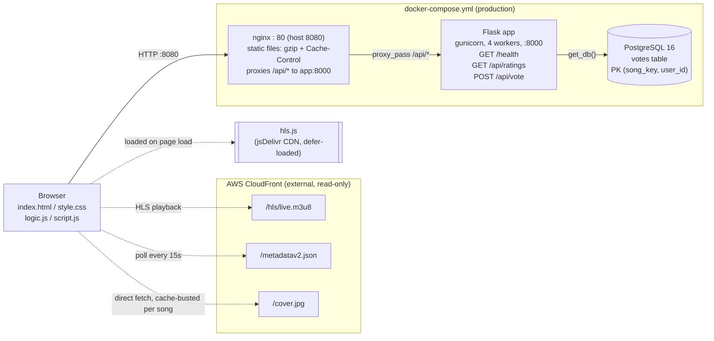

# Architecture

Production topology, as deployed by `docker-compose.yml`:

## Components

- **Browser** — no framework, no build step. `logic.js` (pure helpers) loads before `script.js` (all DOM/streaming/polling logic); both are plain `<script>` tags.
- **nginx** — the only thing the browser talks to over HTTP. Serves the four static files directly (gzip'd, with cache headers — see `nginx/default.conf`) and reverse-proxies everything under `/api/*` to the app container. Never serves `app.py`, `ratings.db`, or anything outside the explicit whitelist.
- **Flask app (gunicorn)** — stateless behind nginx; all persistent state lives in Postgres. `GET /health` checks DB connectivity for load balancer/orchestration probes. `wsgi.py` (not `app.py`) is gunicorn's entrypoint, since it's the one that calls `init_db()`.
- **PostgreSQL** — single `votes` table, `(song_key, user_id)` primary key enforces one vote per user per song at the DB level (atomic `INSERT ... ON CONFLICT DO NOTHING`, not a check-then-insert race).
- **AWS CloudFront** — external, read-only, not part of this repo. The browser talks to it directly for the stream, now-playing metadata, and cover art; nginx/Flask are never in that path.
- **hls.js** — loaded with `defer` since it's only needed once the user presses Play.

## Local dev mode

Running `python app.py` directly (`make dev`) is simpler than the diagram above: just the Flask dev server talking to a local SQLite file (`ratings.db`), serving its own static files, no nginx/gunicorn/Postgres/Docker involved. `DATABASE_URL` is what switches `app.py` between the two backends — see `CLAUDE.md` for the dual-backend `get_db()` details.
